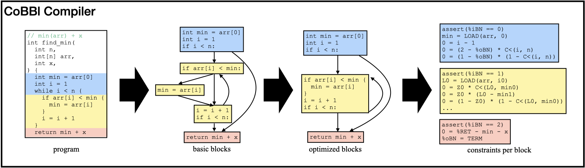

### What is Verifiable Computation and SNARK?
Imagine yourself as a user of cloud services. You want to outsource a computation to a remote server, but the server might be unreliable or even malicious, so you wonder: _how can I be convinced that the output I receive is correct_? This problem of verifiable computation was first formulated in the early 90s, but has becoming increasingly popular recently with the rise of crypto currencies, where, every few minutes, the integrity behind millions of transactions falls onto the shoulder of a single anonymous entity. It has since inspired hundreds of research projects across the globe, motivates an entire DARPA program, and becomes the backbone of a billion-dollar industry.

How to make computations verifiable? One popular approach is through Succinct Non-Interactive Argument of Knowledge (SNARK). In this setup, as the remote machine executes the program, it produces a SNARK proof, which can be used to convince the user of the correctness of the output in time sublinear to the computation. We call the untrusted server that generates the proof _the Prover_ ($\mathcal{P}$) and the user who verifies the proof _the Verifier_ ($\mathcal{V}$).

A SNARK protocol usually contains three steps:
1. Compilation: $\mathcal{V}$, either on its own or through a trusted third party, converts the computation $\Psi$ into some form of a constraint system $\mathcal{C}$, the satisfying assigment of which can only be obtained if $\mathcal{P}$ correctly executes the program. This compilation phase only needs to be performed once per program (and, in some variants, once for _all_ programs).
2. Proving: $\mathcal{P}$ executes the computation to produce a satisfying assignment to $\mathcal{C}$. It then produces a SNARK proof $\pi$ based on the constraints and assignments using one of the many _backend proof protocols_ (like GKR or Spartan).
3. Verifying: $\mathcal{V}$ uses the program input and output to determine the validity of the SNARK proof $\pi$. If $\mathcal{P}$ behaved, it always accepts $\pi$; otherwise, it rejects with overwhelming probability.

### The two predominant ways to SNARK
Regardless of which exact constraint system $\mathcal{V}$ chooses, or what backend proof protocol $\mathcal{P}$ and $\mathcal{V}$ agree on, one thing remains true: the cost of the SNARK protocol scales with the size of the constraints $\mathcal{C}$. This quest to minimize constraint size leads to two main schools of thoughts: direct translators and CPU emulators (also commonly referred to as zkVMs). In fact, almost all existing SNARK systems can be categorized into one school or another.

The most notable direct translators include Pequin and CirC. These SNARK systems contain a built-in constraint compiler that directly translates high-level languages like C into constraints. Direct translators are good at producing the most optimized constraints for individual programs: their compilers can make the best encoding decisions since they have access to the structure and semantics of the entire program. The downside, however, is that the constraints $\mathcal{C}$ need to be fixed at compile time, so it must accounts for all execution paths of $\Psi$. In practice, $\mathcal{C}$ needs to flatten the control flow of $\Psi$: encode both branches of every if / else statement, inline all function calls and unroll every loop up till a static depth. All these transformations results in $\mathcal{P}$ paying the cost of both branches no matter which one is taken, and likewise it always pays for the maximum costs for all loops regardless of the actual number of iterations during an execution.

CPU emulators like vRAM and Jolt take on a completely different approach: instead translating the computation $\Psi$ directly to constraints, they rely on an off-the-shelf compiler to first covert the program into TinyRAM or RISC-V instructions. As a result, verifying the computation now becomes verifying the fetch-decode-execute cycle of a CPU on these instructions. To do so, these systems store the constraint representation of a fixed set of instructions, and when given an execution of $\Psi$ as a sequence of instructions, $\mathcal{P}$ proves the correct execution of each instruction through their corrsponding constraints, as well as the integrity of the CPU model itself: e.g., register state, instruction fetching, memory coherence, etc.

The industry generally prefers CPU emulators, as they allow $\mathcal{P}$ to only pay for what it executes (i.e. no control-flow flattening). However, CPU emulation comes at a cost: by keeping a fixed set of constraints for each instruction, CPU emulators lose opportunities to program-specific optimizations. Furthermore, the usage of off-the-shelf compilers designed for regular CPU routines also introduces instructions otherwise avoidable in a constraint system: most notably, memory accesses related to the call stack, the entirety of which is unnecessary when expressing a computation in constraints.

### The best of both worlds
Facing the two approaches with completely opposite merits and drawbacks, we raise the natural question: _can we design a new SNARK system that both emits constraints tailored for individual programs, and allows the prover to only pay for what it executes_? For $\mathcal{P}$ to pay for what it executes, the system must be able to divide the program up in some way, yet to produce custom constraints, this breakup must occur at a higher-level language and each piece must still be sufficiently large. We settle our design on the concept of basic blocks. In essence, _basic blocks are sequences of instructions of a program that do not contain any control flow in-between_: in other words, once $\mathcal{P}$ executes the first instruction of a basic block, it is guaranteed to execute all remaining instructions (unless it encounters an exception midway). We observe that the moderate size of each basic block permits most constraint tailoring implemented on existing direct translators, and by expressing a program execution as a sequence of basic blocks, $\mathcal{P}$ indeed never pays for instructions it does not execute. To build a block-based SNARK system, however, we still have to solve the following issues:
1. The design of the interface (state passing) between basic blocks. Unlike CPU emulators which strictly adhere to a CPU abstraction (or direct translators which do not have state passing), our block-based system can have program-specific block-to-block state passings.
2. A framework for minimizing the size and number of basic blocks. During the proving and verifying phases, $\mathcal{P}$ pays for the total number of executed blocks, while $\mathcal{V}$ processes each type of executed block at least once. Thus, to minimize the cost for $\mathcal{P}$ and $\mathcal{V}$, the system should aim for minimum size and number of blocks.
3. A compiler implementation that can actually achieve all of the above: dividing a program into basic blocks, performing optimizations on each block, encoding all blocks as constraints, and presenting them in a way for a backend proof system with moderate modifications to generate a SNARK proof.

### CoBBl: a block-based SNARK system
To tackle the above issues, we present a new block-based SNARK system, CoBBl (**C**onstraints **o**ver **B**asic **Bl**ocks). Building a SNARK system is hard. Fortunately, we do not have to start from zero. Our starting point is CirC, a direct translator that can process, among other languages, a custom language called Z# specifically designed for SNARKs. CirC includes functionalities to parse a Z# program into a syntax tree, as well as turning a syntax tree into constraints. The goal of CoBBl is to expand on that syntax tree: divide it into blocks, specify and optimize each block, and express each block as individual syntax trees for CirC to convert them into constraints. Below, we show a simple example of CoBBl in action, converting a `find_min` program into constraints through three stages.

#### Divide a program into basic blocks
This is, in fact, a very straightforward process. Since a basic block cannot contain any control flow within it, CoBBl processes the program linearly, and whenever it encounters a start or an end to a branching statement, a loop, or a function call (i.e., a split or a merge on the program control flow graph), it initializes a new block.

#### Minimize the number of blocks and optimize each block
Blindly dividing a program into blocks based on control flow might not be the most efficient way for constraint generation. A common issue is that the size of the blocks are still too small. In the `find_min` example above, the combination of the while loop with the conditional statement produces three small but interconnected blocks, the size of which are too small for any block- or constraint-level optimization, and the large quantity of which results in blowups in $\mathcal{P}$ and $\mathcal{V}$ cost. The solution is for CoBBl to selectively merge smaller blocks into larger ones using existing flattening techniques (similar to the one used in direct translators). While these techniques allows CoBBl to express multiple blocks using a single sequence of instructions and conditional selects, just like direct translators, they incur extra cost for $\mathcal{P}$ on the merged blocks, like paying for both branches of a conditional statement. CoBBl captures this tradeoff in a user-defined parameter, `MAX_BLOCK_SIZE`, and the rest of the procedure is as follows:
1. CoBBl estimates the number of constraints $\mathcal{C}_b$ for each block $b$. It then deduces $\mathcal{C}_{\text{max}}$, 
2. 