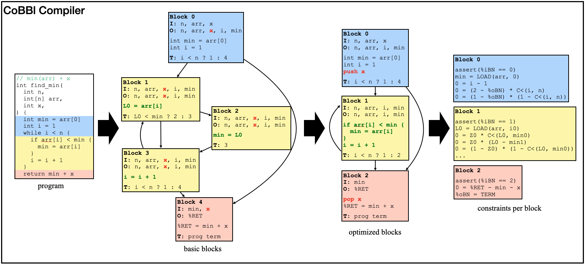
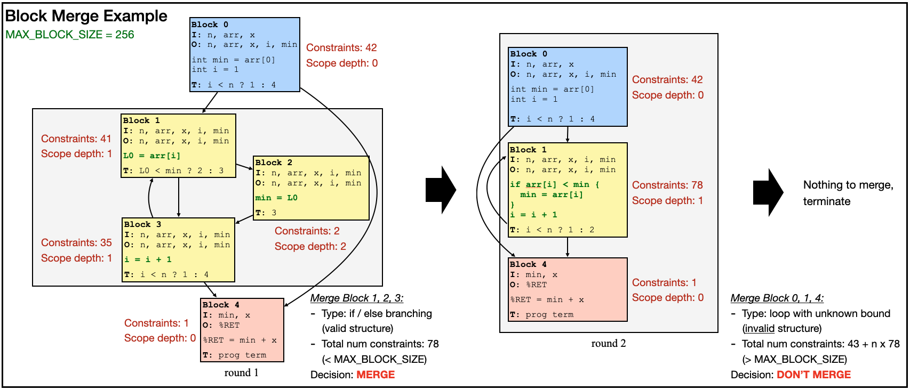

### What is Verifiable Computation and SNARK?
Imagine yourself as a user of cloud services. You want to outsource a computation to a remote server, but the server might be unreliable or even malicious, so you wonder: _how can I be convinced that the output I receive is correct_? This problem of verifiable computation was first formulated in the early 90s, but is becoming increasingly popular recently with the rise of crypto currencies, where, every few minutes, the integrity behind millions of transactions falls onto the shoulder of a single anonymous entity. Verifiable computation has since inspired hundreds of research projects across the globe, motivates an entire DARPA program, and becomes the backbone of a billion-dollar industry.

How to make computations verifiable? One popular approach is through Succinct Non-Interactive Argument of Knowledge (SNARK). In this setup, as the remote machine executes the program, it produces a SNARK proof, which can be used to convince the user of the correctness of the output in time sublinear to the computation. We call the untrusted server that generates the proof _the Prover_ ($\mathcal{P}$) and the user who verifies the proof _the Verifier_ ($\mathcal{V}$).

A SNARK protocol usually contains three steps:
1. Compilation: $\mathcal{V}$, either on its own or through a trusted third party, converts the computation $\Psi$ into some form of a constraint system $\mathcal{C}$, the satisfying assigment of which can only be obtained if $\mathcal{P}$ correctly executes the program. This compilation phase only needs to be performed once per program (and, in some variants, once for _all_ programs), and is often referred to as the _frontend_ of a SNARK system.
2. Proving: given an input $x$, $\mathcal{P}$ executes $\Psi(x)$ to produce an output $y$ and additional witnesses $w$. It then proves that $(x, y, w)$ satisfies $\mathcal{C}$ in a SNARK proof $\pi$ using one of the many _backend_ proof protocols (examples include GKR or Spartan).
3. Verifying: $\mathcal{V}$ checks the validity of $\pi$. If $\mathcal{P}$ behaved, it always accepts $y$; otherwise, it rejects with overwhelming probability.

A variant of SNARK called zkSNARK also emphasizes on an additional zero-knowledge property, where the verifier does not learn anything about the witnesses $w$. This is out of scope for this blog post, and we note that one can always convert a SNARK into a zkSNARK by introducing an additional zero-knowledge recursion proof.

### It's about the execution model!
Regardless of which exact constraint system $\mathcal{V}$ chooses, or what backend proof protocol $\mathcal{P}$ and $\mathcal{V}$ agree on, performance is always a big concern: the prover needs to run fast enough to minimize gas fees; the proof size needs to be small enough to fit into a blockchain; and the verifier cost needs to be efficient even for the cheapest mobile hardware. While SNARK researchers never fail to deliver on better cryptographic concepts, backend system design, and even new constraint representation, they often overlook an equally important aspect -- the _execution model_ of the proof system.

Conceptually, an execution model is the interface between a program's semantics and its execution substrate. A fitting execution model enables the proof system to efficiently representation the computation, while incongruities lead to "wastes" -- excessive descriptions that could otherwise be eliminated.

We can roughly categorize almost all existing SNARK systems into one of the two main schools of thoughts: _direct translators_ and _CPU emulators_ (also commonly referred to as zkVMs, even though many of the zkVM systems are not zero-knowledge). 

The most notable direct translators include Pequin and CirC. These SNARK systems contain a built-in compiler that translates high-level languages like C into constraints. Their compilers have full access to program structure and semantics, and can capture program constructs efficiently expressable in constraints. They can also apply clever optimizations to take advantage of the nondeterministic nature of the constraints, achieving massive savings. The downside, however, is that the constraints $\mathcal{C}$ need to be fixed at compile time, so it must account for all execution paths of $\Psi$. In practice, $\mathcal{C}$ needs to flatten the control flow of $\Psi$: encode both branches of every if / else statement, inline all function calls, and unroll every loop up till a static depth. Thus, $\mathcal{P}$ and $\mathcal{V}$ always pay the cost of both if and else branches, and the maximum costs for all loops regardless of the actual number of iterations.

CPU emulators like vRAM and Jolt take on a completely different approach: instead translating the computation $\Psi$ directly to constraints, they use a set of pre-generated constraints to prove that $y$ is the output of a CPU that applies correct fetch-decode-execute cycles to compute $\Psi$. To build a CPU emulator, a trusted programmer first determines an instruction set: most popular option includes TinyRAM, EVM, and RISC-V. Next, they generate a sequence of constraint sets, each verifies the correctness of one instruction. Finally, at runtime, the verifier $\mathcal{V}$ uses an off-the-shelf compiler to covert $\Psi$ into a sequence of instructions. The prover $\mathcal{P}$ proves the correct execution of each instruction through their corrsponding constraints, as well as the integrity of the CPU model itself: register state, instruction fetching, memory coherence, etc.

CPU emulators allow $\mathcal{P}$ and $\mathcal{V}$ to only pay for what it executes (i.e. no control-flow flattening). However, by keeping a fixed set of constraints independent of $\Psi$, CPU emulators lose opportunities to program-specific, constraint-level optimizations. Furthermore, the execution model often misalign with the proof system. Most notably, a regular CPU routine introduces a call stack to work around limited register space and leverage the memory hierarchy; in a proof system, however, registers are effectively unlimited while all memory accesses are equally expensive. Emulating a call stack -- as most CPU emulators do -- introduces unnecessary memory accesses, creating inefficiencies in the proof.

### The best of both worlds
Facing the two approaches with completely opposite merits and drawbacks, we raise the natural question: _can we design a new SNARK system that both emits constraints tailored for individual programs, and allows the prover to only pay for what it executes_? For $\mathcal{P}$ to pay for what it executes, the system must be able to divide the program up in some way, yet to produce custom constraints, this breakup must occur at a higher-level language and each piece must still be sufficiently large. We settle our design on the concept of basic blocks. In essence, _basic blocks are sequences of instructions of a program that do not contain any control flow in-between_: in other words, once $\mathcal{P}$ executes the first instruction of a basic block, it is guaranteed to execute all remaining instructions (unless it encounters an exception midway). We observe that the moderate size of each basic block permits most constraint tailoring implemented on existing direct translators, and by expressing a program execution as a sequence of basic blocks, $\mathcal{P}$ indeed never pays for instructions it does not execute. To build a block-based SNARK system, however, we still have to solve the following issues:
1. The design of the interface (state passing) between basic blocks. Not only does $\mathcal{P}$ rely on the interface to switch between blocks during execution, the proof of integrity of such interface is also crucial to the overall correctness of the execution. Unlike CPU emulators which strictly adhere to a CPU abstraction (or direct translators which do not have state passing), our block-based system can have program-specific block-to-block state passings.
2. A framework for minimizing the number of basic blocks and optimizing each one.
3. A compiler implementation that can actually achieve all of the above: dividing a program into basic blocks, performing optimizations on each block, encoding all blocks as constraints, and presenting them in a way for a backend proof system to generate a SNARK proof.

### Our foundation: a data-parallel backend proof system
While our new SNARK system CoBBl uses a customized version of Spartan as its backend, the goal is to support most existing backend proof protocols with limited modification. Thus, we elide the details of CoBBl backend and instead present a general framework of backend protocols that CoBBl operates on. In particular, we list three fundamental aspects of a CoBBl-compatible backend:
1. _Data-parallelism_: $\mathcal{V}$ verifies the satisfiability of multiple assignments to the same constraint set in parallel. This allows $\mathcal{V}$'s cost to be linear to number of blocks but sublinear to number of executions of each block. This is a standard feature for almost all CPU emulators.
2. _Offline Memory Check_: $\mathcal{P}$ proves memory coherence throughout the entire execution in time linear to number of memory accesses. $\mathcal{V}$ verifies in time sublinear to number of memory accesses. One such technique is attributed to Ben-Sasson et al. [CITE] and is now the standard approach to memory check.
3. _Cross-Chip Lookup_: $\mathcal{P}$ proves a claim regarding two assignments to _two different constraint sets_ in time linear to the claim. $\mathcal{V}$ verifies the same claim on multiple pairs of assignments in parallel. This feature allows $\mathcal{P}$ to show the correctness of state passing between consecutive blocks (i.e., outputs of a block match with inputs of its successor), and is implemented in systems like SP1 [CITE].

### CoBBl: a block-based SNARK system
Finally, we present our new block-based SNARK system, CoBBl (**C**onstraints **o**ver **B**asic **Bl**ocks). Building a SNARK system is hard, but fortunately, we do not have to start from zero. Our starting point is CirC, a direct translator that can process, among other languages, a custom language called Z# specifically designed for SNARKs. CirC includes functionalities to parse a Z# program into a syntax tree, as well as turning a syntax tree into constraints, and constraints into input formats for various backend systems. The goal of CoBBl is to expand on that syntax tree: divide it into blocks, specify and optimize each block, and express each block back to individual syntax trees for CirC to convert them into constraints. Below, we show a simple example of CoBBl in action, converting a `find_min` program into constraints through three stages.

#### Divide a program into basic blocks
Each basic block is consisted of three components: a _header_ that contains the block label, inputs, and outputs; a sequence of instructions executed by the block; and a transition statement that either specifies the transition to the next block, or marks program termination. At the end of the execution, the program output is stored in a special register, `%RET`.

Since basic blocks cannot contain any control flow, CoBBl generates them by linearly scanning the program, and initializes a new block for each split or a merge on the program control flow graph (e.g. a start or an end to a branching statement or a loop). To ensure that no duplicate blocks are generated for a function with multiple callsites, CoBBl introduces another special register `%RP` to record the label of the return block after a function call. Every callsite to the function sets their own `%RP`, and the transition statement of the final block points to the block with the same label as the value of `%RP`.

After producing all the basic blocks, CoBBl also produces a round of "standard" compiler optimizations on each block, including liveness analysis, dead code elimination, and inlining of all functions that only have one callsite (i.e., replacing `%RP` with its only possible value).

#### Minimize the number of blocks and optimize each block
Blindly dividing a program into blocks based on control flow might not be the most efficient way for constraint generation. A common issue is small block size. In the `find_min` example above, block 1, 2, and 3 each only have one instruction (or two, counting the transition statement) -- too few for any block- or constraint-level optimization. Yet, for each execution of these blocks, $\mathcal{P}$ and $\mathcal{V}$ need to verify the correct passing of a moderate amount of input variables as well as the block transition itself, resulting in cost blowups. The solution is for CoBBl to selectively merge smaller blocks into larger ones using existing flattening techniques (similar to the ones used in direct translators). While these techniques allow CoBBl to express multiple blocks using a single sequence of instructions and conditional selects, just like direct translators, they incur extra cost for $\mathcal{P}$ on the merged blocks -- it now needs to pay for both branches of a conditional statement. CoBBl captures this tradeoff in a user-defined parameter, `MAX_BLOCK_SIZE`, and the rest of the procedure is as follows:
1. CoBBl estimates the number of constraints $|\mathcal{C}_b|$ for each block $b$ (including the transition statement). It then deduces $|\mathcal{C}_{\text{max}}|$, the maximum size allowed for a merged block, computed as the maximum between `MAX_BLOCK_SIZE` and $\max_b|\mathcal{C}_b|$.
2. To merge blocks, CoBBl keeps track of $\mathcal{M}_b$, the estimated size of the merged block starting at block $b$. In particular:
    * If $b$ does not initiate a conditional jump, then CoBBl sets $\mathcal{M}_b$ to $|\mathcal{C}_b|$.
    * If $b$ initiates a function call, merging is undesirable -- any uninlined function has multiple callsites. To denote this, CoBBl sets $\mathcal{M}_b = \bot$.
    * If $b$ is the head of a loop of unknown bound, CoBBl does not know how many times to unroll the loop, so it sets $\mathcal{M}_b = \bot$ and leaves the loop unchanged.
    * Finally, if $b$ is the head of a conditional jump with branch targets $\ell$ and $r$, and join point block $t$, CoBBl recursively computes $\mathcal{M}_\ell$, $\mathcal{M}_r$, and $\mathcal{M}_t$; merging all of these blocks together would yield a block of size $\mathcal{M}_b = |\mathcal{C}_b| + \mathcal{M}_\ell + \mathcal{M}_r + \mathcal{M}_t$.  
    If $\mathcal{M}_b \leq |\mathcal{C}_{\text{max}}|$, CoBBl flattens $b, \ell, r, t$ into a single block; otherwise, it leaves them alone. Unrolling a loop of static bound $n$ is similar, except $\mathcal{M}_b = |\mathcal{C}_b| + n\cdot\mathcal{M}_{body} + \mathcal{M}_t$.
3. CoBBl repeats step 2 until either no more block can be merged, or every $\mathcal{M}_b$ exceeds $|\mathcal{C}_{\text{max}}|$.

Below, we demonstrate block merge in action on the `find_min` example:

#### Design an interface between blocks
Even with the most constraint-friendly block format, the proof is incomplete without $\mathcal{P}$ demonstrating that the program state is consistent during each block transition: in particular, the value of each variable stays the same between blocks. CoBBl offers two ways to transmit the value of a variable $x$ from the end of block $i$ to the beginning of block $j$: passing $x$ as a register or pushing $x$ onto a _scope stack_. 

The block design in the previous section allows each block to specify its input and output registers. Thus, CoBBl can include $x$ as an output register of block $i$ ($x_o$) and an input register of block $j$ ($x_i$). If $j$ is the direct successor of $i$, $\mathcal{P}$ can prove that $x_o = x_i$ using Cross-Chip Lookup; otherwise, however, $x$ needs to be passed along every block between $i$ and $j$, resulting in multiple Cross-Chip Lookups.