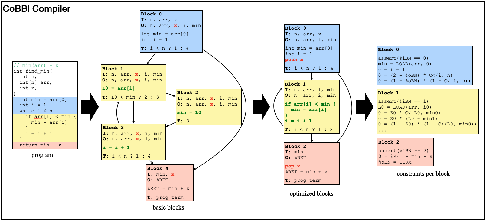
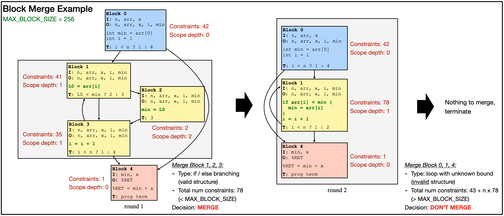
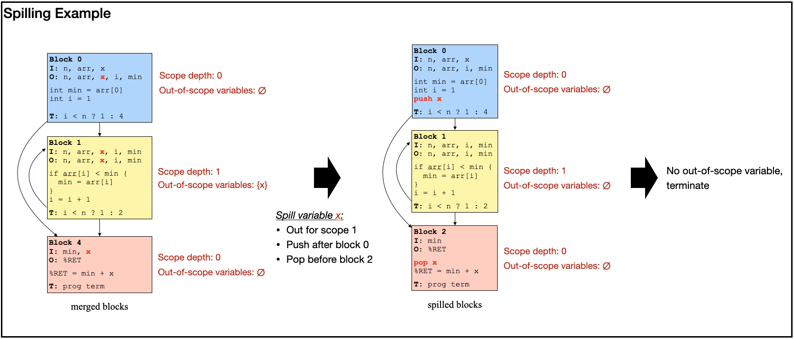

### What is Verifiable Computation and SNARK?
Imagine yourself as a user of cloud computing. The server returns an answer, but the server could be buggy, unreliable, or even malicious. How can you be confident that the result is correct without redoing the entire computation yourself? This is the problem of _verifiable computation_. For many years, verifiable computation was studied mostly as a theoretic question, but cryptocurrencies have made it practical and urgent. In these crypto systems, enormous financial value depends on the correct processing of transactions by participants who are often anonymous and untrusted. Verifiable computation makes this possible by allowing correctness to be established through mathematical proofs rather than reputation or trust. As a result, it is now the backbone of the billion-dollar industry, and one of the key ideas driving modern cryptography research and deployment.

How do we make computations verifiable? One popular approach is to use a Succinct Non-Interactive Argument of Knowledge (SNARK). In this approach, as the remote machine executes the program, it produces a SNARK proof. This proof allows the user to check the correctness of the output much more efficiently than by rerunning the computation from scratch. We call the untrusted server that generates the proof _the Prover_ ($\mathcal{P}$) and the user who verifies the proof _the Verifier_ ($\mathcal{V}$).

A SNARK protocol usually contains three steps:
1. Compilation: The verifier $\mathcal{V}$, either on its own or through a trusted third party, encodes the computation $\Psi$ into a set of constraints $\mathcal{C}$ in a standard format such as R1CS or Plonk. The goal is to represent the computation so that a satisfying assignment exists only when the program has been executed correctly. This compilation phase only needs to be performed once per program (and, in some SNARK variants, once for _all_ programs), and is often referred to as the _frontend_ of a SNARK system.
2. Proving: given an input $x$, $\mathcal{P}$ executes $\Psi(x)$ to produce an output $y$, along with a witness $w$ that includes intermediate computations and other data that facilitates the verification process. The prover then generates a SNARK proof $\pi$ showing that $(x, y, w)$ satisfies the constraint system $\mathcal{C}$, via a _backend_ proving protocol, such as GKR or Spartan.

3. Verifying: $\mathcal{V}$ checks the validity of $\pi$. If the prover followed the protocol and the computation was carried out correctly, $\mathcal{V}$ accepts. Otherwise, it rejects except with negligible probability..

Some SNARK systems also satisfy an additional _zero-knowledge_ property, meaning that the verifier learns nothing about the witness $w$ beyond the fact that the computation was carried out correctly. These variants are called zkSNARKs. They are outside the scope of this blog post, but for our purposes, it suffices to view zero knowledge as an extra privacy layer added on top of the core verifiability guarantees of a SNARK.

### It's about the execution model!
Performance is a critical concern for any SNARK system, regardless of its chosen constraint system or backend protocol. The proof generation time for even the most efficient SNARK prover is still thousands of times slower than directly executing the program. The proof, while usually small in size, is still non-trivial to fit within a block on the blockchain. Finally, for the system to be scalable, the verifier needs to be efficient for even the cheapest mobile hardware. While SNARK researchers continue to deliver better cryptographic concepts, backend system designs, and even brand new constraint representations, they often overlook an equally important aspect -- the _execution model_ of the proof system.

An execution model is, conceptually, the bridge between a program’s semantics and the machinery used to prove its execution. A well-chosen execution model allows the proof system to represent the computation efficiently, while a poor fit introduces overhead: extra structure and constraints that do not reflect meaningful work in the original program. Today, most SNARK systems follow one of two dominant execution models: _direct translators_ and _CPU emulators_ (often called zkVMs, even though many of these systems are not inherently zero-knowledge). 

The most prominent examples of direct translators include Pequin and CirC. These systems feature a built-in compiler that translates a high-level program directly into a single, monolithic constraint system $\mathcal{C}$. Because the compiler has full access to the program’s structure and semantics, it can encode many constructs very efficiently and apply optimizations specific to constraint systems rather than ordinary machine execution, often leading to substantial savings.

The main drawback is that the constraint system $\mathcal{C}$ must be fixed at compile time, and therefore must cover every possible execution path of $\Psi$. In practice, this requires flattening the program’s control flow: both branches of each if/else statement must be encoded, function calls are inlined, and loops must be unrolled up to a predetermined bound. As a result, both the prover $\mathcal{P}$ and the verifier $\mathcal{V}$ pay for the worst-case structure of the program rather than the specific path taken during execution. They incur the cost of both branches of every conditional and of the maximum number of loop iterations, regardless of what actually occurs at runtime.

Direct translators aim to encode a program as a single, straightforward constraint system. While this can produce an efficient representation for an individual program, it also prevents the proof system from taking advantage of other useful features. For instance, many modern SNARK backends support data parallelism, so that multiple executions of the same constraint system can be verified together. But when the entire program is flattened into one monolithic set of constraints, there is little opportunity to expose this kind of parallelism. Likewise, many proof systems include specialized tools for proving properties such as correct memory accesses or complex instructions more efficiently than with generic constraints alone. These tools are hard to integrate into the monolithic representations produced by direct translators. As a result, direct translators often miss important optimization opportunities, and their reliance on a fixed, monolithic constraint system further makes them less appealing in industrial settings.

CPU emulators such as vRAM and Jolt take a very different approach. Instead of translating the computation $\Psi$ directly into constraints, they begin with a fixed CPU model and prove that this CPU executed the program correctly, step by step, through its fetch-decode-execute cycle. To build such a system, a trusted designer first chooses an instruction set, with common choices including TinyRAM, the EVM, and RISC-V. The system then generates constraints that capture the correct behavior of each instruction. For a particular program $\Psi$, the verifier $\mathcal{V}$ can use a conventional compiler to translate $\Psi$ into an instruction trace. The prover $\mathcal{P}$ then proves that this trace was executed correctly by the CPU model, including not only the correct behavior of each instruction, but also the consistency of the machine state itself, such as register updates, instruction fetching, and memory coherence.

CPU emulators allow $\mathcal{P}$ and $\mathcal{V}$ to pay only for the instructions that are actually executed, eliminating the need for control-flow flattening. However, because they use a fixed constraint system that does not depend on $\Psi$, they lose the ability to apply program-specific optimizations at the constraint level. Moreover, the execution model of a conventional CPU is often poorly aligned with that of a proof system. For example, CPU programs rely heavily on a call stack to manage limited register space and exploit the memory hierarchy. In a proof system, however, registers are effectively unlimited, while all memory accesses are equally expensive. Emulating a call stack in this setting, as many CPU emulators do, is therefore often unnecessary and inefficient. In this sense, CPU emulators overcome the static rigidity of direct translators only by imposing a different cost: they sacrifice highly optimized, program-specific constraint representations and require the proof system to reproduce hardware mechanisms that are redundant for proving.

### The best of both worlds
Given these two execution models, each with its own strengths and weaknesses, a natural question arises: _can we design a SNARK system that generates constraints tailored to each program, avoids redundant hardware mechanisms, and charges the prover and the verifier only for the code that is actually executed_? We answer this question with a new execution model designed specifically for proof systems. It is designed to expose data parallelism within the computation while keeping communication between parallel segments small. We build this execution model around the notion of _basic blocks_, and call the resulting system CoBBl (**C**onstraints **o**ver **B**asic **Bl**ocks).

In essence, a basic block is a straight-line sequence of instructions with no internal branches: once $\mathcal{P}$ begins executing the block, the instructions proceed in order unless an exception intervenes. As a result, if the proof is organized around the sequence of basic blocks that are actually executed, neither $\mathcal{P}$ nor $\mathcal{V}$ pays for instructions that never run. Turning this idea into an efficient block-based SNARK system, however, raises several challenges:

1. **Choosing the right blocks.** Longer instruction sequences can often be represented by constraints that are simpler than the sum of their instruction-by-instruction encodings. In addition, the cost to $\mathcal{P}$ and $\mathcal{V}$ grows with the number of distinct blocks that must be handled. To leverage these two properties, CoBBl should use a small collection of blocks, each covering a reasonably large segment of the program. Unfortunately, in real programs, basic blocks are often short and numerous. CoBBl therefore needs a way to merge smaller blocks into larger ones while keeping the resulting control-flow flattening overhead modest compared with that of direct translators.

2. **Designing a sound and efficient interface between basic blocks.** The interface between blocks should allow the prover to move quickly from one block to the next, while keeping the cost of proving each transition low. Unlike CPU emulators, which inherit a fixed CPU-level state abstraction, and unlike direct translators, which avoid explicit state passing altogether, CoBBl must define its own transition interface between blocks. This flexibility creates an opportunity for program-specific optimization, but also raises a challenge: the interface must be expressive enough to capture the program state needed for soundness, yet compact enough to avoid introducing significant proof overhead.

3. **Capturing program structure in a block-based representation.** Producing program-specific constraints requires the compiler to preserve and reason about high-level program information throughout the translation process. In a block-based setting, additional savings often come from reasoning beyond the blocks themselves. To realize these savings, the blocks alone are not enough: CoBBl’s compiler must also track information such as scope, control flow, and memory allocation, and use it to guide additional cross-block compiler optimizations.

With these goals in mind, CoBBl includes a full compiler pipeline: it partitions the program into basic blocks, merges and optimizes them, encodes them as constraints, and organizes the resulting representation so that a backend proof system can generate a SNARK proof.

### Our foundation: a data-parallel backend proof system
CoBBl is meant to work with many existing backend proof protocols, with only small modifications. So rather than focusing on one concrete implementation, we describe the general backend properties that CoBBl needs. In particular, a CoBBl-compatible backend should provide the following:
1. _Data-parallelism_: a CoBBl-compatible backend should allow $\mathcal{P}$ to prove many assignments to the same constraint set in time linear in the number of assignments, while allowing $\mathcal{V}$ to verify them in time sublinear in the number of assignments. In particular, the verifier’s time should be linear only in the number of distinct blocks, rather than in the total number of executed block instances. This allows CoBBl to exploit repeated executions of the same block efficiently.”
2. _Batched consistency checks_: a CoBBl-compatible backend should allow $\mathcal{P}$ to prove claims about many pairs of assignments, drawn either from the same constraint set or from different constraint sets, in time linear in the number of pairs, while allowing $\mathcal{V}$ to verify those claims in time sublinear in the number of pairs. This serves as a basic primitive for relating different parts of an execution, such as maintaining register consistency across block transitions. Many existing techniques, including memory coherence checks, can also be built on top of this capability.

### The CoBBl frontend
Finally, we present our new block-based SNARK system. Building a SNARK system is a complex task, but fortunately, we do not need to start from scratch. We build on CirC, a direct translator that supports several languages, including Z#, a custom language designed for SNARKs. CirC takes a Z# program, builds an internal representation of it, translates that representation into constraints, and emits the result in formats compatible with different backend proof systems. CoBBl changes this process at the level of the program representation. It first divides the program into blocks, then performs optimizations on individual blocks and across block boundaries, and finally reuses CirC’s existing machinery to convert each block into constraints. Below, we show a simple `find_min` example to illustrate how CoBBl carries out this translation in three stages.

#### Divide a program into basic blocks
Each basic block in CoBBl has four parts: a header containing the block label, inputs, and outputs; a sequence of instructions executed within the block; a transition statement that either identifies the next block or signals program termination; and auxiliary metadata, such as the function name, scope depth, and memory-allocation information. At the end of execution, the program’s output is stored in a special register, `%RET`.

Since basic blocks are straight-line chunks of code with no internal control flow, CoBBl’s compiler constructs them by scanning the program and starting a new block whenever control flow splits or merges: for example, at the beginning or end of a branch, loop, or function call. Since a function may be called from multiple sites, CoBBl introduces another distinguished register, %RP, to record the label of the block to return to after the call. Each call site sets %RP to its own return label, and each function returns by jumping to the block labeled by `%RP`.

Once the basic blocks have been constructed, CoBBl applies a round of standard compiler optimizations to them, including liveness analysis, constant propagation, and inlining functions that have only a single call site: i.e., replacing `%RP` with its unique possible value.

#### Minimize the number of blocks and optimize each block
Strictly following the standard definition of basic blocks often produces many small blocks. This is undesirable for two reasons: it increases proof overhead, and it limits the compiler’s ability to find larger, more constraint-friendly representations of the computation. In the find_min example above, for instance, blocks 1, 2, and 3 each contain only a single instruction. Even so, every execution of these blocks requires $\mathcal{P}$ and $\mathcal{V}$ to account for the transfer of several input values as well as the identity of the next block. When this happens repeatedly, the overhead can become substantial.

CoBBl addresses this issue by selectively merging small blocks into larger ones, using the same kind of control-flow flattening techniques that appear in direct translators. Importantly, these merges preserve the program’s scoping information, so the compiler can still reason about the original structure of the code even after blocks have been combined. These merges create a tradeoff. Larger blocks often admit more efficient constraint encodings and reduce inter-block overhead, but they may also reintroduce some of the cost of flattening by forcing $\mathcal{P}$ and $\mathcal{V}$ to pay for execution paths that are not taken. CoBBl controls this tradeoff with a user-defined parameter, MAX_BLOCK_SIZE, which sets the largest merged block the compiler is willing to produce.

At a high level, CoBBl estimates the constraint cost of each candidate merged block and performs the merge only when the result remains below this threshold. In general, it avoids merging across boundaries where flattening would be especially costly or ill-defined, such as uninlined function calls or loops with unknown bounds. The compiler repeats this process until no further profitable merges remain.

Below, we demonstrate block merge in action on the `find_min` example:

#### Design an interface between blocks
Even with a constraint-friendly block representation, the proof is incomplete unless $\mathcal{P}$ also establishes that the program state is passed correctly from one block to the next. In particular, values that remain live across a block transition must be carried forward consistently. Otherwise, suppose one block computes a temporary value that will only be used several blocks later. If that value is dropped, overwritten, or replaced by a different one along the way, then each block might still look locally correct, but the overall execution is wrong.

CoBBl supports two ways to carry such values across blocks. The first is to include them directly in the transition state, using the input and output registers associated with each block. In this case, CoBBl uses cross-block consistency checks to prove that the output of block $i$ matches the input of block $i+1$.

The second is to spill values into an stack-like storage mechanism which we call the _scope stack_. This is only used for variables that are out of scope across a sequence of blocks. In that case, carrying the value explicitly through every intermediate block would be wasteful, as those blocks cannot legally access it. CoBBl can instead push the value on to the scope stack before that sequence begins and pop it out when the variable comes back into use. Restricting spilling to out-of-scope variables is important, since otherwise a later restoration would not necessarily correspond to the correct live variable. This approach is also attractive from the proof-system perspective, because the stack-like storage admits an efficient constraint representation.

Below, we demonstrate an example of register spilling:

### Finishing touches and future work
As CoBBl’s compiler constructs the blocks and their transition interfaces, it also applies several smaller optimizations, such as eliminating empty blocks and assigning transition registers to variables that cross block boundaries. It then emits one constraint set for each optimized block, together with the metadata needed for the batched consistency and memory-coherence checks. During execution, the prover supplies assignments to the block-level constraints, optionally through the CoBBl frontend, and invokes the backend to produce a succinct proof for the entire execution, which the verifier can then check efficiently.

Through its new block-based execution model, CoBBl is the first SNARK system to generate constraints tailored to individual programs, avoid redundant hardware mechanisms, and ensure that both the prover and the verifier pay only for the code that is actually executed. More broadly, CoBBl also points toward a wider design space for future improvements.

On the compiler side, CoBBl’s current optimization pipeline is still shaped by many of the same conventions that guide traditional compilers, even though the SNARK setting does not always require them. In particular, traditional compiler design is largely organized around producing a valid execution order, whereas in a SNARK the verifier only needs a proof of correctness and need not follow the original computation step by step. This extra flexibility is often discussed in the SNARK literature under the name _nondeterminism_, though in many existing systems it is exploited only in fairly local ways. CoBBl suggests that the same idea can be pushed much further at the level of whole code sequences and block interactions. On the proof-system side, CoBBl is also well positioned to incorporate more recent advances, most notably _lookup arguments_, which allow a SNARK system to obtain the outputs of complex instructions from a precomputed table rather than encode their full computation in constraints. A tighter integration between compiler design and these proof techniques could allow the compiler to dynamically replace certain code sequences with lookups, yielding significant efficiency gains.