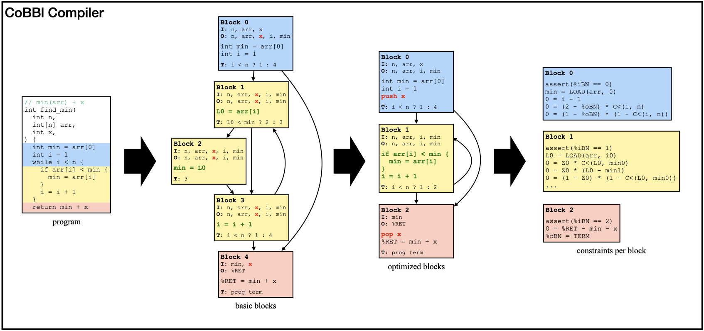

### What is Verifiable Computation and SNARK?
Imagine yourself as a user of cloud services. You want to outsource a computation to a remote server, but the server might be unreliable or even malicious, so you wonder: _how can I be convinced that the output I receive is correct_? This problem of verifiable computation was first formulated in the early 90s, but is becoming increasingly popular recently with the rise of crypto currencies, where, every few minutes, the integrity behind millions of transactions falls onto the shoulder of a single anonymous entity. Verifiable computation has since inspired hundreds of research projects across the globe, motivates an entire DARPA program, and becomes the backbone of a billion-dollar industry.

How to make computations verifiable? One popular approach is through Succinct Non-Interactive Argument of Knowledge (SNARK). In this setup, as the remote machine executes the program, it produces a SNARK proof, which can be used to convince the user of the correctness of the output in time sublinear to the computation. We call the untrusted server that generates the proof _the Prover_ ($\mathcal{P}$) and the user who verifies the proof _the Verifier_ ($\mathcal{V}$).

A SNARK protocol usually contains three steps:
1. Compilation: $\mathcal{V}$, either on its own or through a trusted third party, converts the computation $\Psi$ into some form of a constraint system $\mathcal{C}$, the satisfying assigment of which can only be obtained if $\mathcal{P}$ correctly executes the program. This compilation phase only needs to be performed once per program (and, in some variants, once for _all_ programs), and is often referred to as the _frontend_ of a SNARK system.
2. Proving: given an input $x$, $\mathcal{P}$ executes $\Psi(x)$ to produce an output $y$ and additional witnesses $w$. It then proves that $(x, y, w)$ satisfies $\mathcal{C}$ in a SNARK proof $\pi$ using one of the many _backend_ proof protocols (examples include GKR or Spartan).
3. Verifying: $\mathcal{V}$ checks the validity of $\pi$. If $\mathcal{P}$ behaved, it always accepts $y$; otherwise, it rejects with overwhelming probability.

A variant of SNARK called zkSNARK also emphasizes on an additional zero-knowledge property, where the verifier does not learn anything about the witnesses $w$. This is out of scope for this blog post, but we note that the prover can convert a SNARK into a zkSNARK by producing an additional zero-knowledge proof on the correctness of the original proof.

### It's about the execution model!
Regardless of which exact constraint system $\mathcal{V}$ chooses, or what backend proof protocol $\mathcal{P}$ and $\mathcal{V}$ agree on, performance is always a big concern: the prover needs to run fast enough to minimize gas fees; the proof size needs to be small enough to fit into a blockchain; and the verifier cost needs to be efficient for even the cheapest mobile hardware. While SNARK researchers never fail to deliver on better cryptographic concepts, backend system design, and even new constraint representation, they often overlook an equally important aspect -- the _execution model_ of the proof system.

Conceptually, an execution model is the interface between a program's semantics and its execution substrate. A fitting execution model enables the proof system to efficiently representation the computation, while incongruities lead to "wastes" -- excessive descriptions that could otherwise be unnecessary. Currently, almost all existing SNARK systems adopt one of the two predominant execution models : _direct translators_ and _CPU emulators_ (also commonly referred to as zkVMs, even though many of the zkVM systems are not zero-knowledge). 

The most notable direct translators include Pequin and CirC. These SNARK systems contain a built-in compiler that translates a program in a high-level languages into one monolithic set of constraints $\mathcal{C}$. Their compilers have full access to program structure and semantics, and can capture program constructs efficiently expressable in constraints. They can also apply clever optimizations to take advantage of the nondeterministic nature of the constraints, achieving massive savings. The downside, however, is that the constraints $\mathcal{C}$ need to be fixed at compile time, so it must account for all execution paths of $\Psi$. In practice, $\mathcal{C}$ needs to flatten the control flow of $\Psi$: encode both branches of every if / else statement, inline all function calls, and unroll every loop up till a static depth. Thus, $\mathcal{P}$ and $\mathcal{V}$ always pay the cost of both if and else branches, and the maximum costs for all loops regardless of the actual number of iterations.

Direct translators have the exact execution model as the constraint formalism $\mathcal{C}$, which enables them to produce optimized constraints for a given program. However, they fail to take advantage of other features of the proof system: namely, its design for highly data-parallel computations and the availability of specialized gadgets, such memory coherence check and lookup arguments, which are often performed more efficiently out-of-circuit than within $\mathcal{C}$. This flaw, combined with the static nature of the monolithic constraints, makes direct translators less appealing to modern crypto industry.

CPU emulators like vRAM and Jolt take on a completely different approach: instead translating the computation $\Psi$ directly to constraints, they use a set of pre-generated constraints to prove that $y$ is the output of a CPU that applies correct fetch-decode-execute cycles to compute $\Psi$. To build a CPU emulator, a trusted programmer first determines an instruction set: most popular option includes TinyRAM, EVM, and RISC-V. Next, they generate the constraints for the correctness of each instruction. Finally, for a given program $\Psi$, the verifier $\mathcal{V}$ uses an off-the-shelf compiler to convert $\Psi$ into a list of instructions. The prover $\mathcal{P}$ proves the correct execution of each instruction through their corrsponding constraints, as well as the integrity of the CPU model itself: register state, instruction fetching, memory coherence, etc.

CPU emulators allow $\mathcal{P}$ and $\mathcal{V}$ to only pay for what it executes (i.e. no control-flow flattening). However, by keeping a fixed set of constraints independent of $\Psi$, CPU emulators lose opportunities to program-specific, constraint-level optimizations. Furthermore, the execution model of a CPU often misaligns with that of a proof system. Most notably, a regular CPU routine introduces a call stack to work around limited register space and leverage the memory hierarchy; in a proof system, however, registers are effectively unlimited while all memory accesses are equally expensive. Emulating a call stack -- as most CPU emulators do -- introduces unnecessary memory accesses and leads to inefficiencies in the proof.

### The best of both worlds
Facing the two execution models with starkly different merits and drawbacks, we raise the natural question: _can we create a new SNARK system that emits constraints tailored for individual programs, avoids excessive memory accesses, and allows the prover to only pay for what it executes_? The key to our innovation lies in an execution model designed _for_ the proof system, which should fully leverage data-parallelism within the computation, yet minimize data transfer between these data-parallel segments. We base our execution model on the concept of _basic blocks_, and name our SNARK system CoBBl (**C**onstraints **o**ver **B**asic **Bl**ocks).

In essence, a basic block is a straight-line sequence of instructions with no internal branches; once $\mathcal{P}$ starts executing it, all instructions are executed sequentially unless an exception intervenes. Consequently, by basing the proof on a sequence of executed basic blocks, $\mathcal{P}$ and $\mathcal{V}$ never pays for instructions it does not execute. To build an efficient block-based SNARK system, however, there are a few lingering obstacles:
1. **Designing a sound and efficient interface between basic blocks.** Not only does $\mathcal{P}$ rely on the interface to switch between blocks during execution, the integrity proof of such interface is also essential for overall correctness. Unlike CPU emulators which strictly adhere to a CPU abstraction (or direct translators which do not have state passing), CoBBl's block-based system supports program-specific state transfers between blocks.
2. **Maximizing block size and minimizing the number of unique blocks.** Programs that are sufficiently complex are often representable with simpler constraints than those derived instruction by instruction. To leverage this property, CoBBl must also emit program segments that are adequately large. Furthermore, since the proof is based on basic blocks, the costs for $\mathcal{P}$ and $\mathcal{V}$ inevitably scale with the number of unique blocks. These two factors together necessitate a mechanism in CoBBl for merging smaller blocks.
3. **Implementing an end-to-end compiler.** To express arbitrary programs in its block-based execution model, CoBBl relies on a full compiler pipeline: dividing a program into basic blocks, merging and performing optimizations on each block, encoding all blocks as constraints, and presenting them in a way for a backend proof system to generate a SNARK proof.

### Our foundation: a data-parallel backend proof system
CoBBl's goal is to support most existing backend proof protocols with limited modification. Thus, we elide details on CoBBl's concrete implementation and instead present a general framework of backend protocols that CoBBl operates on. In particular, we list three fundamental aspects of a CoBBl-compatible backend:
1. _Data-parallelism_: $\mathcal{P}$ proves the satisfiability of multiple assignments to the _same constraint set_ (i.e. the same block) in linear time, while $\mathcal{V}$ verifies in sublinear time. Thus, $\mathcal{V}$’s cost is linear only in the number of unique blocks; all other factors are sublinear. Since the number of unique blocks is asymptotically smaller than the overall execution size, CoBBl’s proof remains succinct.
2. _Offline memory check_: $\mathcal{P}$ proves memory coherence across the entire execution in time linear to number of memory accesses. $\mathcal{V}$ verifies in time sublinear to number of memory accesses.
3. _Cross-constraint lookup_: Given a claim on a pair of assignments to _different constraint sets_, $\mathcal{P}$ proves the claim on multiple assignment pairs in linear time, while $\mathcal{V}$ verifies in time sublinear to the number of pairs. This enables $\mathcal{P}$ to establish correctness of transitions between different block types.

### CoBBl: a block-based SNARK system
Finally, we present our new block-based SNARK system. Building a SNARK system is hard, but fortunately we do not have to start from zero. Our starting point is CirC, a direct translator that can process, among other languages, a custom language called Z# specifically designed for SNARKs. CirC includes functionalities to parse a Z# program into a syntax tree, as well as turning a syntax tree into constraints, and constraints into input formats for various backend systems. The goal of CoBBl is to expand on that syntax tree: dividing it into blocks, specifying and optimizing each block, and expressing each block back to individual syntax trees for CirC to convert them into constraints. Below, we show a simple example of CoBBl in action, converting a `find_min` program into constraints through three stages.

#### Divide a program into basic blocks
Each basic block is consisted of three components: a _header_ that contains the block label, inputs, and outputs; a sequence of instructions executed by the block; and a transition statement that either specifies the transition to the next block, or marks program termination. At the end of the execution, the program output is stored in a special register, `%RET`.

Since basic blocks cannot contain any control flow, CoBBl generates them by linearly scanning the program, and initializes a new block for each split or a merge on the program control flow graph (e.g. a start or an end to a branching statement or a loop). To ensure that no duplicate blocks are generated for a function with multiple callsites, CoBBl introduces another special register `%RP` to record the label of the return block after a function call. Every callsite to a function sets their own `%RP`, and every function terminates by returning to the block labeled by `%RP`.

After producing all the basic blocks, CoBBl also produces a round of "standard" compiler optimizations on each block, including liveness analysis, constant propagation, and inlining of all functions that only have one callsite (i.e., replacing `%RP` with its only possible value).

#### Minimize the number of blocks and optimize each block
Generating blocks solely off program control flow often lead to large quantity of small blocks. As explained earlier, this increases $\mathcal{V}$'s cost and hinders CoBBl's ability to find constraint-friendly representations. In the `find_min` example above, block 1, 2, and 3 each only have one instruction. Yet, for each execution of these blocks, $\mathcal{P}$ and $\mathcal{V}$ need to verify the correct passing of a moderate amount of input variables as well as the block transition itself, resulting in cost blowups. CoBBl addresses this by selectively merging smaller blocks into larger ones using existing flattening techniques (as in direct translators). The program is now expressable with fewer and larger blocks, but these blocks contain branches, and $\mathcal{P}$ and $\mathcal{V}$ must bear the cost of all execution paths. CoBBl captures this tradeoff in a user-defined parameter, `MAX_BLOCK_SIZE`, and the rest of the procedure is as follows:
1. CoBBl estimates the number of constraints $|\mathcal{C}_b|$ for each block $b$. It then deduces $|\mathcal{C}_{\text{max}}|$, the maximum size allowed for a merged block, computed as the maximum between `MAX_BLOCK_SIZE` and $\max_b|\mathcal{C}_b|$.
2. To merge blocks, CoBBl keeps track of $\mathcal{M}_b$, the estimated size of the merged block starting at block $b$. In particular:
    * If $b$ does not initiate a conditional jump, then CoBBl sets $\mathcal{M}_b$ to $|\mathcal{C}_b|$.
    * If $b$ initiates a function call, merging is undesirable -- any uninlined function has multiple callsites. To denote this, CoBBl sets $\mathcal{M}_b = \bot$.
    * If $b$ is the head of a loop of unknown bound, CoBBl does not know how many times to unroll the loop, so it sets $\mathcal{M}_b = \bot$ and leaves the loop unchanged.
    * Finally, if $b$ is the head of a conditional jump with branch targets $\ell$ and $r$, and join point block $t$, CoBBl recursively computes $\mathcal{M}_\ell$, $\mathcal{M}_r$, and $\mathcal{M}_t$; merging all of these blocks together would yield a block of size $\mathcal{M}_b = |\mathcal{C}_b| + \mathcal{M}_\ell + \mathcal{M}_r + \mathcal{M}_t$.  
    If $\mathcal{M}_b \leq |\mathcal{C}_{\text{max}}|$, CoBBl flattens $b, \ell, r, t$ into a single block; otherwise, it leaves them alone. Unrolling a loop of static bound $n$ is similar, except $\mathcal{M}_b = |\mathcal{C}_b| + n\cdot\mathcal{M}_{body} + \mathcal{M}_t$.
3. CoBBl repeats step 2 until either no more block can be merged, or every $\mathcal{M}_b$ exceeds $|\mathcal{C}_{\text{max}}|$.

Below, we demonstrate block merge in action on the `find_min` example:

#### Design an interface between blocks
Even with the most constraint-friendly block format, the proof is incomplete without $\mathcal{P}$ demonstrating that the program state is consistent during each block transition: in particular, the value of each variable stays the same between blocks. CoBBl offers two ways to transmit the value of a variable $x$ from the end of block $i$ to the beginning of block $j$: passing $x$ as a register or pushing $x$ onto a _scope stack_. 

The block design in the previous section allows each block to specify its input and output registers. Thus, CoBBl can include $x$ as an output register of block $i$ ($x_o$) and an input register of block $j$ ($x_i$). If $j$ is the direct successor of $i$, $\mathcal{P}$ can prove that $x_o = x_i$ using Cross-Chip Lookup; otherwise, however, $x$ needs to be passed along every block between $i$ and $j$, resulting in multiple Cross-Chip Lookups.